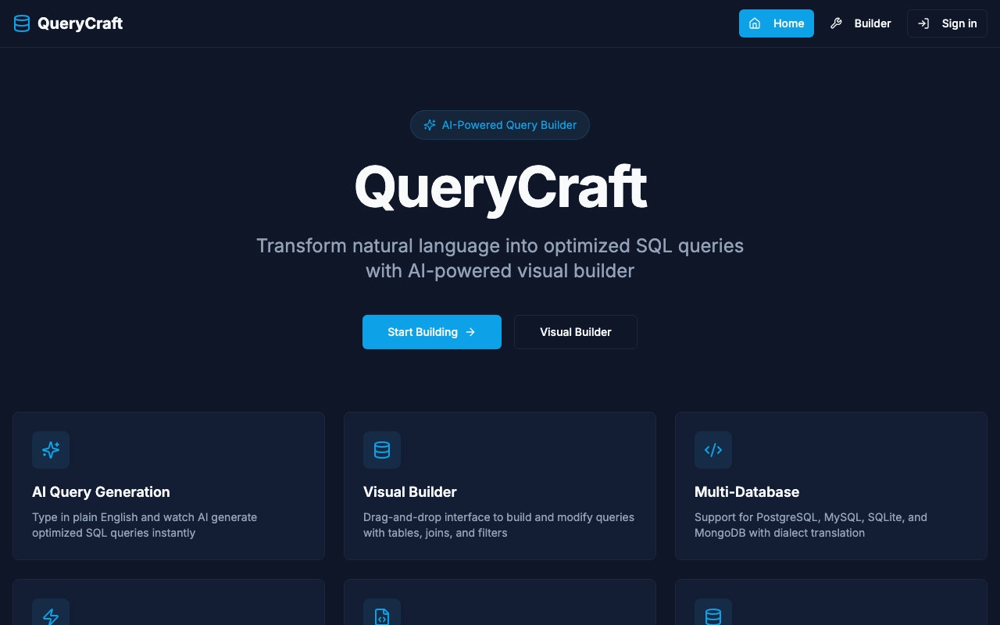

# QueryCraft

> AI-powered SQL query builder with natural language processing and advanced query analysis.

**Live Demo**: [querycraft-app.web.app](https://querycraft-app.web.app)

---



---

## Features

### Natural Language → SQL
- Describe queries in plain English; QueryCraft generates optimized SQL
- Multi-dialect support: PostgreSQL, MySQL, SQLite, SQL Server
- Multi-query mode for complex transactional operations
- Schema-aware generation when a schema is loaded

### Query Analysis
| Panel | What it does |
|---|---|
| **Explain** | Section-by-section breakdown in plain English |
| **Optimize** | Rewrites query + suggests indexes, shows diff |
| **Debug** | Detects errors, explains root cause, suggests fix |
| **Performance** | Execution plan simulation, cost estimate, bottlenecks |
| **Lint** | Real-time syntax and best-practice checking |

### Advanced Analysis
| Panel | What it does |
|---|---|
| **Dialect Cost** | Side-by-side cost comparison across all 4 dialects |
| **Blast Radius** | Impact analysis when schema changes affect saved queries |
| **Anomaly Detect** | Flags queries that deviate from historical patterns |
| **Budget Enforcer** | Checks query cost against a configurable unit budget |
| **Fingerprint** | Normalizes and deduplicates structurally similar queries |
| **Assertion Tester** | Compiles natural-language constraints into SQL CHECKs |
| **Time Machine** | Versioned query history with rollback |
| **Changelog** | Semantic diff between two query versions |
| **Schema Recs** | AI-driven index and schema improvement recommendations |

### Conversion & Export
- Convert SQL between dialects with side-by-side diff view
- Export to ORM code: Prisma, TypeORM, Sequelize, Drizzle, Knex.js
- Generate realistic mock result data from any query

### Schema Tools
- Upload schema from SQL DDL, JSON, or an image (OCR)
- Visual schema designer with drag-and-drop ER diagram
- AI schema generator from a description
- Schema drift analysis + migration generator

### Collaboration
- Share queries via URL or encoded link
- Inline code review on shared queries
- Query history with bookmarking

---

## Getting Started

### Prerequisites
- Node.js 20+
- npm 9+

### Local development

```bash
# 1. Clone
git clone <repo-url>
cd querycraft

# 2. Install root dependencies
npm install

# 3. Set up the backend
cd server
npm install
cp .env.example .env   # then configure your AI provider — see AI Provider Setup below

# 4. Run database migrations
npx prisma migrate dev

# 5. Start both servers (two terminals)
# Terminal 1 — backend  (port 3000)
npm run dev

# Terminal 2 — frontend (port 8080, from repo root)
cd ..
npm run dev
```

### Docker (all-in-one)

```bash
JWT_SECRET=<random-64-char-hex> \
docker compose up --build
```

This starts three services: `frontend` (nginx), `backend` (Express), and a local LLM. The local LLM is used by default when no cloud API key is configured. To use a cloud provider instead, pass the corresponding key as an environment variable.

---

## AI Provider Setup

Open `server/.env` and configure one of the following options:

**Option A — Local LLM (free, no rate limits)**

Install a local LLM runtime, pull a model, then set `OLLAMA_MODEL` in `server/.env`.

**Option B — Cloud AI provider**

Set one of the API key variables in `server/.env`:
```
GEMINI_API_KEY=your_key
OPENAI_API_KEY=your_key
ANTHROPIC_API_KEY=your_key
GROQ_API_KEY=your_key
```

The local LLM takes priority when `OLLAMA_MODEL` is set. See `server/.env.example` for the full list of options.

---

## Architecture

```
┌─────────────────────────────────────────────────┐
│                  Browser (React)                │
│  ┌──────────┐  ┌──────────┐  ┌──────────────┐  │
│  │ Builder  │  │  Schema  │  │ Visual Query │  │
│  │  (NL/SQL)│  │   Tab    │  │   Builder    │  │
│  └────┬─────┘  └────┬─────┘  └──────┬───────┘  │
│       └──────────────┴──────────────┘           │
│                    API layer (src/lib/api.ts)    │
└──────────────────────┬──────────────────────────┘
                       │ HTTP / JSON
┌──────────────────────▼──────────────────────────┐
│              Express API (Node.js / TS)         │
│                                                 │
│  ┌────────────┐  ┌─────────────┐  ┌──────────┐ │
│  │  /api/v1   │  │ /api/v1/    │  │  /api/   │ │
│  │  core SQL  │  │  advanced   │  │  auth    │ │
│  │  routes    │  │  routes     │  │  routes  │ │
│  └─────┬──────┘  └──────┬──────┘  └────┬─────┘ │
│        └────────────────┴───────────────┘       │
│                   aiProvider.ts                 │
│  ┌──────────────────────────────────────────┐  │
│  │  Provider auto-selection (priority order) │  │
│  │  Local LLM → Cloud providers             │  │
│  │  (first configured key wins)             │  │
│  └──────────────────────────────────────────┘  │
│                                                 │
│                Prisma ORM → SQLite / PostgreSQL │
└─────────────────────────────────────────────────┘
```

### Data model (key entities)

```
User ──< QueryHistory
     ──< SavedQuery
     ──< DatabaseConnection
     ──< AuditLog
     ──< RefreshToken

SharedQuery ──< QueryReview

QueryVersion      (versioned SQL history, per queryName)
QueryFingerprint  (normalized query deduplication)
AIFeedback        (per-feature rating)
```

---

## Tech Stack

### Frontend
| Layer | Library |
|---|---|
| Framework | React 18 + TypeScript |
| Build | Vite + SWC |
| UI components | Radix UI + shadcn/ui |
| Styling | Tailwind CSS |
| Flow diagrams | @xyflow/react |
| Charts | Recharts |
| Syntax highlight | prism-react-renderer |
| Data fetching | TanStack Query v5 |
| Routing | React Router v6 |
| Forms | React Hook Form + Zod |

### Backend
| Layer | Library |
|---|---|
| Runtime | Node.js 20 + TypeScript |
| HTTP | Express 4 |
| ORM | Prisma (SQLite dev / PostgreSQL prod) |
| Auth | JWT (access + refresh tokens) |
| Logging | Pino + pino-http |
| Security | Helmet, express-rate-limit, CORS |
| API docs | Swagger / OpenAPI |

### AI
Supports a local LLM (free, no rate limits) or any major cloud AI provider via API key.

---

## API Reference

Base path: `/api` (also aliased at `/api/v1`)

### Core SQL

| Method | Path | Description |
|---|---|---|
| `POST` | `/generate-sql` | Natural language → SQL |
| `POST` | `/explain-sql` | Explain query in plain English |
| `POST` | `/optimize-sql` | Optimize + suggest indexes |
| `POST` | `/convert-sql` | Convert between dialects |
| `POST` | `/debug-sql` | Detect errors and suggest fixes |
| `POST` | `/analyze-performance` | Execution plan simulation |
| `POST` | `/mock-results` | Generate sample result data |
| `POST` | `/export-orm` | Generate ORM code |
| `POST` | `/generate-schema` | AI schema generation |
| `POST` | `/image-to-schema` | OCR schema from an image |
| `POST` | `/query-suggestions` | Autocomplete suggestions |
| `POST` | `/generate-multi-sql` | Multi-query generation |
| `POST` | `/sql-to-natural` | SQL → plain English |
| `GET`  | `/ai-status` | Active provider info |

### Advanced Analysis

| Method | Path | Description |
|---|---|---|
| `POST` | `/advanced/semantic-diff` | Semantic equivalence check |
| `POST` | `/advanced/schema-drift` | Drift analysis vs query history |
| `POST` | `/advanced/infer-migrations` | Generate migration DDL |
| `POST` | `/advanced/dialect-cost` | Cross-dialect cost comparison |
| `POST` | `/advanced/blast-radius` | Impact of schema changes |
| `POST` | `/advanced/anomaly-detect` | Anomaly scoring vs baseline |
| `POST` | `/advanced/schema-recommend` | Index / schema recommendations |
| `POST` | `/advanced/fingerprint` | Normalize and deduplicate |
| `POST` | `/advanced/compile-assertions` | Natural language → SQL CHECKs |
| `POST` | `/advanced/budget-check` | Cost budget enforcement |

### Auth

| Method | Path | Description |
|---|---|---|
| `POST` | `/auth/register` | Create account |
| `POST` | `/auth/login` | Get access + refresh tokens |
| `POST` | `/auth/refresh` | Rotate refresh token |
| `POST` | `/auth/logout` | Revoke refresh token |
| `GET`  | `/auth/me` | Current user profile |
| `POST` | `/auth/forgot-password` | Initiate password reset |
| `POST` | `/auth/reset-password` | Complete password reset |

### Query History & Versions

| Method | Path | Description |
|---|---|---|
| `GET`  | `/history` | Paginated query history |
| `POST` | `/history` | Add to history |
| `DELETE` | `/history/:id` | Delete entry |
| `GET`  | `/history/saved` | Saved / bookmarked queries |
| `POST` | `/history/saved` | Save a query |
| `PUT`  | `/history/saved/:id` | Update saved query |
| `DELETE` | `/history/saved/:id` | Delete saved query |
| `POST` | `/versions` | Save a query version |
| `GET`  | `/versions/:queryName` | List versions for a query |
| `DELETE` | `/versions/:id` | Delete a version |
| `POST` | `/versions/diff` | Semantic changelog between two versions |

Interactive API docs: `/api-docs` (Swagger UI).

---

## AI Accuracy Benchmark

The semantic equivalence classifier ships with a 10-case ground-truth eval:

```bash
cd server
npm run eval:semantic-diff
```

Reports **Accuracy**, **Precision**, **Recall**, and **F1** against your configured provider. Cases cover: tautological WHERE, predicate commutivity, `COUNT(*)` vs `COUNT(1)`, `DISTINCT` vs `GROUP BY`, JOIN type semantics, sort direction, LIKE wildcard position, and soft-delete filters.

---

## Project Structure

```
querycraft/
├── src/                    # React frontend
│   ├── components/         # All feature components
│   │   ├── ui/             # shadcn/ui primitives
│   │   ├── PerformanceAnalyzer.tsx
│   │   ├── SQLDebugger.tsx
│   │   ├── VisualQueryBuilder.tsx
│   │   └── ...
│   ├── pages/
│   │   └── Builder.tsx     # Main app page
│   ├── context/            # Auth + Schema context
│   └── lib/
│       ├── api.ts          # API client
│       └── queryManager.ts # Local history helpers
├── server/
│   ├── src/
│   │   ├── index.ts        # Express app + all core routes
│   │   ├── aiProvider.ts   # Multi-provider AI abstraction
│   │   └── routes/         # Feature-specific routers
│   │       ├── advanced.ts # 10 advanced analysis endpoints
│   │       ├── auth.ts
│   │       ├── history.ts
│   │       ├── versions.ts
│   │       └── reviews.ts
│   ├── prisma/
│   │   └── schema.prisma   # DB schema
│   └── scripts/
│       └── eval-semantic-diff.ts
├── docker-compose.yml
├── Dockerfile              # Frontend (nginx)
└── server/Dockerfile       # Backend
```

---

## License

MIT
